  

  
  &nbsp;
  

  

  

  

  <picture>
    <source media="(prefers-color-scheme: dark)" srcset="https://raw.githubusercontent.com/temponi-bernardo/temponi-bernardo/output/snake-dark.svg">
    <source media="(prefers-color-scheme: light)" srcset="https://raw.githubusercontent.com/temponi-bernardo/temponi-bernardo/output/snake-light.svg">
    
  </picture>

<code>eof — press any key to continue_</code>

